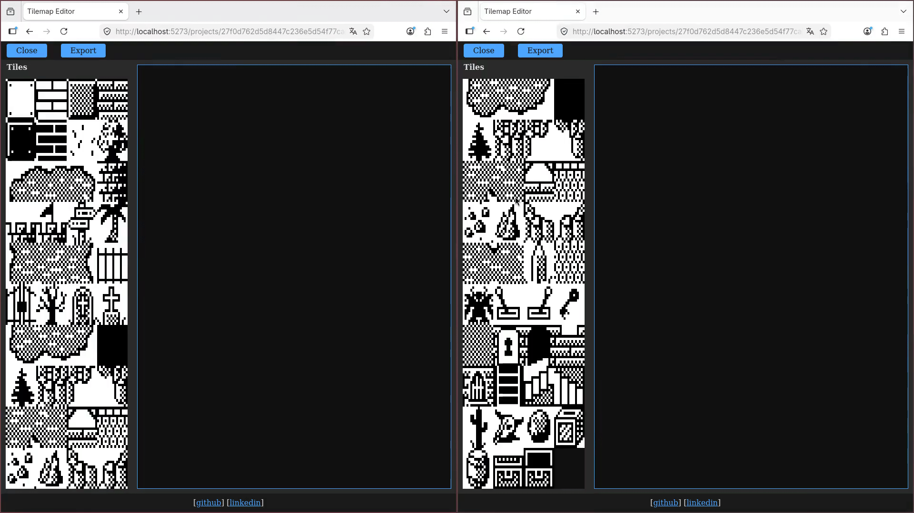

# Tilemgr

> A real-time collaborative tilemap editor built to explore distributed state management on the web.



---

## About

Tilemgr is a web exploration exercise. It lets multiple users edit a tilemap together in the browser, with changes synchronized in real time over WebSockets. You can import PNG tilesets, paint tiles and export the result to a compact binary format.

--- 

## Getting started

Requires the .NET 9 SDK.

```bash
git clone https://github.com/garipew/tilemgr
cd tilemgr
dotnet run
```

Then open ´http://localhost:5273´ in your browser.

---

## Export format

Tilemgr allows users to export projects to a custom binary format at any time. The structure of the binary file is :

- **First line:** width and height as space-separated integers
- **Remaining content:** the tilemap data compressed with RLE

The format was designed with the full cycle of the tool in mind. An editor is only useful if you can consume its output.

```

---

## Roadmap
### Back-end

- [ ] Capture sigint and close connections, also saves projects 
- [ ] Check for name collision with existing project on creation, refuse name or resolve conflict?
- [ ] Update DB to PostgreSQL 

### Front-end

- [ ] Improve UI on tile picker, highlight selected tile
- [ ] Add navigation on tilemap viewport

### Both

- [ ] Display cursor position of users on tilemap
- [ ] Add authentication
- [ ] Add owners to projects 

### Other

- [ ] Add docker image

## Changelog

- [x] Save on DB and unload project when last user disconnects ([commit](https://github.com/garipew/tilemgr/commit/0ec71553d0bc15f3630131291b981f36cdacfffe))
- [x] Share projects in-memory to reduce DB interactions ([commit](https://github.com/garipew/tilemgr/commit/689ad0d624f86faa1d5419ae09f367a580cacd92))
- [x] Redirect to new project at creation ([commit](https://github.com/garipew/tilemgr/commit/a450c6593d0e32cbc9f8cba9c0a0dab69be38453))
- [x] Add export route ([commit](https://github.com/garipew/tilemgr/commit/b8a9f40e72b541f265244fce125e308e29963b3e))
- [x] Add RLE compression of canvas([commit](https://github.com/garipew/tilemgr/commit/2f878aa989d5851451186e0692cd1f9d76f92b88))
- [x] Fix bug on selector, only works until specific height ([commit](https://github.com/garipew/tilemgr/commit/e984acbd3d63aef5a618b32ba26825f77e3981a5))
- [x] Use canvas as viewport ([commit](https://github.com/garipew/tilemgr/commit/439e8497fe1c73130cd3b2fed0f1d69011a2dc60))
- [x] Add zoom ([commit](https://github.com/garipew/tilemgr/commit/10c5996b82fa970b46db4b2e7b4263dae0ea91df))
- [x] Update editor page layout ([commit](https://github.com/garipew/tilemgr/commit/42762836b87240f87d0da56f9f620b3e8bbfcad9))
- [x] Modularize editor.js ([commit](https://github.com/garipew/tilemgr/commit/aaec265177cd5f4dbe04d652bfce45b422ef7fa8))
- [x] Update README, add roadmap

---

## Contributing

Issues and pull requests are welcomed.

___

## License

This project is licensed under MIT license.
